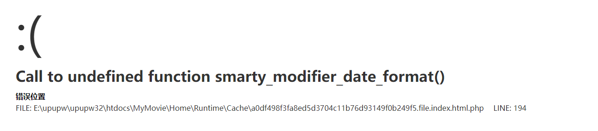
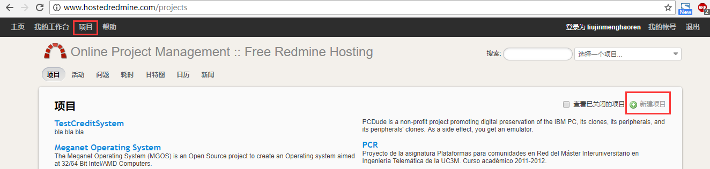
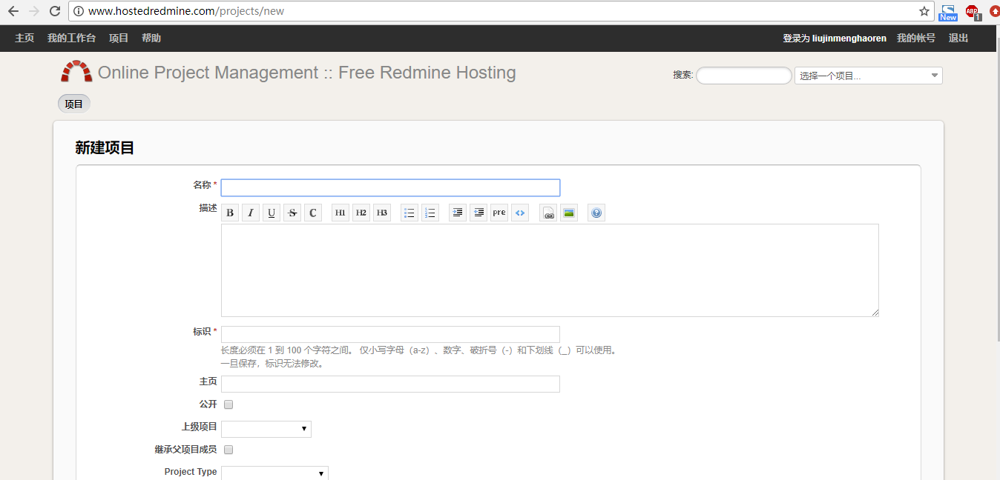

# 测试基础期末大作业实验手册

期末大作业主要是同学们一学期的学习成果的体现，

- 实验要求：对给定系统进行测试，要求有测试用例及bug提交
- 环境准备：
	- [UPUPW绿色服务器平台](http://www.upupw.net/)：是Windows下很有特色的一款免费服务器PHP套件，用来给被测系统提供运行环境。
	- 解压文件，找到UPUPW.exe,以管理员身份运行该程序，会看到命令面板，s1启动所有服务后即可在浏览器访问案例系统，s5可以结束所有服务。
		- `zl_shop系统的前台地址：http://localhost:8032/zl_shop/`
		- `zl_shop系统的管理后台地址：http://localhost:8032/zl_shop/admin.php`
		- `MyMovie系统的前台地址：http://localhost:8032/MyMovie/`
		- `MyMovie系统的管理后台地址：http://localhost:8032/MyMovie/admin.php`
	- 问题解决
		- 报如图错误，清楚缓存即可解决  
		
		- 如果打不开，还有一种错误是数据库有干扰，也可以通过错误信息看出来，打开任务管理器，将正在运行的多余的数据库任务关掉即可。
	- [hostedredmine](http://www.hostedredmine.com/)：是一个开源的项目管理平台，用来做测试用例的管理和缺陷的管理。

- 实验要求：
	- 全班分小组完成作业
	- 小组内分任务，每人至少提交 30 条测试用例和 bug 提交
- 实验过程：
	- 在 hostedredmine 上创建项目，并填好项目信息，如下图所示：  
	  
	
	- 将组内成员都加入到项目中
	- 参照如下示例，用‘问题’提交测试用例和缺陷，其中测试用例的表格用到[Markdown语法](https://www.jianshu.com/p/191d1e21f7ed)，自行学习，或者参照示例中的写法书写。
- 示例
	- [测试用例示例](http://www.hostedredmine.com/issues/615709)
	- [提交bug示例](http://www.hostedredmine.com/issues/604862)

