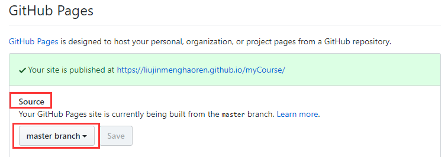

# Git 与  GitHub

### 环境

- GitHub 账号
- Git Bash

### Git 版本控制工作流程

1. 设置用户名和邮箱，第一个命令查看设置信息，如已设置可以省略此步这里的用户名是 GitHub 的账号，邮箱是 GitHub 的绑定邮箱 
```
git config --list
git config --global user.name ""
git config --global user.email ""  
```
2. 在 GitHub 账号中创建一个新仓库
3. 克隆远程仓库到本地
```
git clone https://github.com/username/仓库名 
```
4. 在本地仓库做一些增删改(可以把自己之前写的页面放进来)
```
touch a.txt
```
5. 查看仓库中文件的状态
```
git status  
```
6. 将工作区的更改提交到暂存区
```
git add/rm file
```
7. 将暂存区的更改提交到本地仓库
```
git commit -m "message"
```
8. 将本地仓库的更改同步到远程仓库（即自己 GitHub 中）
```
git push (origin master)  
```
9. push 时需要输入用户名和密码，先运行下面的命令，可以记录密码，以后 push 可以免密
```
git config --global credential.helper store  
```

### 团队合作

1. 一个小组共用一个仓库，由团队中的某个成员创建；
2. 将组内所有人设置为本仓库的协作者，邀请方式为：settings —> Collaborators
3. 组员每次提交成果前，先拉取远程仓库最新的版本，再进行自己的操作
```
git pull (origin master)
```

### Git Pages

设置 Git Pages 可以分配一个地址，直接显示网页的效果。操作如下：

1. 打开仓库
2. settings
3. Git Pages，将 source 设置为 master branch，如下：


