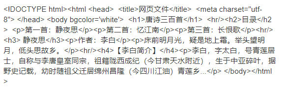
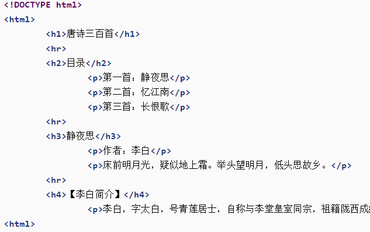
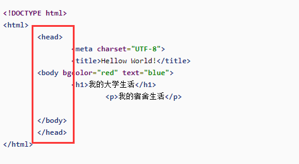
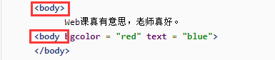
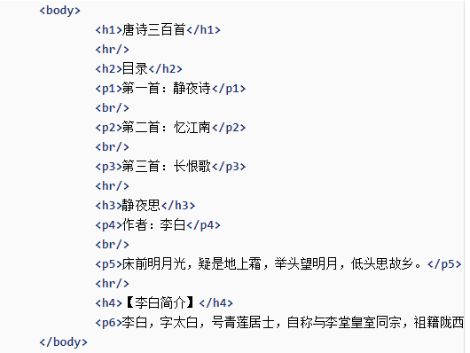
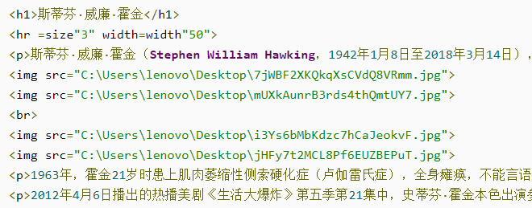

# 第二周作业分析

### 作业中出现的问题

1. 插入代码  
	
2. 代码缩进  
	
3. 基本结构   
	
4. ```<body></body>```  
	
5. ```<p></p>```  
	
6. 图片路径  
	


### 经验教训

1. 上课一定认真听课
2. 基本结构要记牢
3. 使用正确标签
4. 正确合理嵌套
5. 标签要关闭
6. 代码缩进要正确
7. 图片引入用相对路径，目录结构要规范